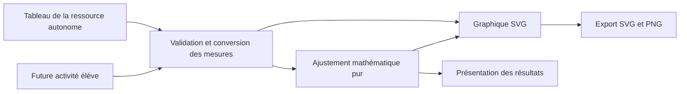

# Tracé de mesures et ajustement de droite dans PhyChem Lab

Note exploratoire du 17 septembre 2026. Orientation confirmée : une ressource autonome, réutilisable ensuite dans les activités. Cette note prépare la conception ; elle ne constitue ni une spécification validée ni une implémentation. Les spécifications et tickets du dépôt restent dans GitHub Issues.

## Ce que montre Regressi

Regressi distingue le tableau de grandeurs et le graphique. Les grandeurs possèdent notamment un nom et une unité ; le graphique permet de choisir les coordonnées. La modélisation ajuste une fonction aux mesures, avec des bornes et une consultation des résidus. La documentation décrit la droite affine et le passage par l’origine. Références : [grandeurs et saisie, p. 45–48](https://regressi.fr/documentation/Regressi.pdf#page=45), [coordonnées, p. 38–40](https://regressi.fr/documentation/Regressi.pdf#page=38), [modélisation, p. 22–30](https://regressi.fr/documentation/Regressi.pdf#page=22).

Les détails algorithmiques renvoient à d’autres documents, p. 30. Les choix ci-dessous sont nos propositions pour PhyChem Lab ; aucune équivalence numérique avec Regressi n’est revendiquée.

## Proposition de première version

Une ressource intitulée provisoirement **« Tracé et régression »**, ouverte depuis le catalogue des activités, avec un tableau et un graphique visibles simultanément sur ordinateur. Sur petit écran, le tableau précède le graphique. Le classement comme activité élève est une proposition cohérente avec l’usage autonome défini dans [CONTEXT.md](../../CONTEXT.md), à confirmer lors de la spécification.

Parcours proposé :

1. Nommer les deux grandeurs, par exemple intensité `I` en mA et tension `U` en V.
2. Saisir les couples de valeurs ou coller deux colonnes depuis un tableur.
3. Voir immédiatement le nuage de points, avec les grandeurs et unités sur les axes.
4. Activer « Ajouter une droite de régression » : modèle affine par défaut ; option explicite « Imposer le passage par l’origine ».
5. Lire l’équation, la pente et l’ordonnée à l’origine avec leurs unités, puis exporter le graphique.

| Élément | Comportement proposé |
| --- | --- |
| Mesures | Deux colonnes numériques ; ajout, correction et suppression de lignes au clavier. |
| Saisie française | Accepter `1,25`, `1.25` et `1,25e-3`. Une cellule vide reste vide ; `12abc` est invalide. |
| Collage | Tabulations ou point-virgule ; aperçu si le format est ambigu, car la virgule peut être décimale. |
| Graphique | Points non reliés par défaut, grille discrète, échelles linéaires automatiques et commande de retour au cadrage automatique. |
| Sélection | Sélectionner une ligne met son point en évidence, et inversement ; les coordonnées restent accessibles dans le tableau. |
| Ajustement | Affine `y = ax + b` ou proportionnel `y = ax` ; recalcul après validation d’une modification. |
| Point exclu | Case « Inclure dans l’ajustement » ; point conservé et visuellement distinct ; nombre de points utilisés visible. |
| Résultats | Coefficients, équation, nombre de points ; `R²` pour l’affine lorsqu’il est défini. |
| Export | SVG vectoriel et PNG comprenant axes, unités, points et droite active ; export des mesures en CSV à point-virgule. |

La saisie de coordonnées signifie ici l’entrée de valeurs dans le tableau. Ajouter ou déplacer une mesure à la souris serait une fonction pédagogique distincte, à prévoir seulement si un usage la justifie.

Une droite ajustée serait limitée par défaut à l’intervalle des abscisses utilisées. Une ligne provisoirement incomplète ne produit aucun point ; une ligne invalide est signalée, avec un décompte explicite des lignes utilisables. Aucun retrait automatique de valeur aberrante.

À différer : plusieurs séries, colonnes calculées, expressions libres, ajustements non linéaires, incertitudes et pondération, axes logarithmiques, acquisition de capteurs, formats natifs Regressi et sauvegarde complète rechargeable. Un panneau de résidus et une sélection d’intervalle constituent de bonnes extensions après validation du parcours initial.

## Calcul et interprétation

Pour l’affine, retenir les moindres carrés ordinaires, qui minimisent la somme des carrés des écarts verticaux. Avec les moyennes `x̄` et `ȳ` :

```text
Sxx = Σ (xi − x̄)²
Sxy = Σ (xi − x̄)(yi − ȳ)
a = Sxy / Sxx
b = ȳ − a × x̄
```

Ces formules sont documentées par le [NIST, Least Squares](https://www.itl.nist.gov/div898/handbook/pmd/section4/pmd431.htm). Pour le passage imposé par l’origine, la minimisation avec `b = 0` donne `a = Σ(xi × yi) / Σ(xi²)` ; il faut refaire le calcul, et non effacer l’ordonnée à l’origine de l’ajustement affine.

Conventions proposées pour les diagnostics : résidu `ei = yi − (a × xi + b)` ; pour l’affine, `R² = 1 − Σei² / Σ(yi − ȳ)²`. Afficher « non défini » si toutes les ordonnées sont identiques. Pour le modèle proportionnel, différer `R²` afin de ne pas mélanger conventions centrée et non centrée. Deux points distincts suffisent à définir une droite affine mais ne permettent pas d’apprécier la dispersion autour de celle-ci : expliquer ce cas dans le résultat.

L’aide doit préciser que cet ajustement n’utilise pas d’incertitudes de mesure, et que `R²` ne constitue pas une validation de loi physique. Les moindres carrés sont sensibles aux points atypiques et l’extrapolation demande de la prudence : [NIST, propriétés et limites](https://www.itl.nist.gov/div898/handbook/pmd/section1/pmd141.htm).

Le moteur retournerait des états explicites pour les situations suivantes :

- Moins de deux couples valides et inclus : tracé possible, ajustement désactivé par choix pédagogique.
- Toutes les abscisses identiques : ajustement affine impossible ; le proportionnel reste calculable si la somme des carrés des abscisses est non nulle.
- Toutes les abscisses nulles : pente proportionnelle indéterminable.
- Calcul non fini ou dispersion numériquement inexploitable : message explicite, jamais de coefficient `NaN` affiché.

Utiliser des calculs centrés, une mise à l’échelle si nécessaire et des tolérances relatives documentées. Préserver la précision interne ; arrondir uniquement les valeurs affichées.

## Intégration au dépôt

Le dépôt possède un catalogue typé et une distribution Vite multipage ; la seule ressource actuellement déclarée est la construction des rayons. Il ne contient pas encore de composant générique de tracé de mesures. Sources locales : [découverte des ressources](../../src/discover_resources.ts), [métadonnées](../../src/resource_metadata.ts), [configuration de construction](../../vite.config.ts).

Architecture proposée :



Le noyau mathématique reçoit des couples numériques normalisés et un choix de modèle. Il renvoie coefficients, résidus et diagnostics, sans DOM ni stockage. Le graphique reçoit les points, les axes et l’ajustement éventuel. L’interface conserve séparément le texte des cellules, les lignes sélectionnées et les exclusions. Une activité pourra ainsi fournir ses propres mesures et verrouiller certains réglages sans afficher le tableau complet.

Organisation indicative, à matérialiser seulement lors de l’implémentation :

```text
activites/trace-regression/index.html
src/resources/activities/plot_regression/resource.ts
src/resources/activities/plot_regression/mount_regression_activity.ts
src/scientific/measurements/parse_measurements.ts
src/scientific/measurements/convert_measurement_units.ts
src/scientific/regression/fit_straight_line.ts
src/scientific/graphs/render_scatter_plot.ts
src/scientific/graphs/export_scatter_plot.ts
```

Le choix des chemins HTML suit les URL françaises du site ; les sources suivent les conventions de nommage personnelles. Une petite API entre calcul et affichage suffit : inutile de concevoir dès maintenant un moteur universel de modèles.

Respect des décisions existantes :

- **SVG** pour le graphique et son export, conformément à [l’ADR 0002](../adr/0002-render-scientific-scenes-as-svg.md). Commencer avec TypeScript et les API natives déjà disponibles ; évaluer une bibliothèque seulement si un besoin concret apparaît.
- **Calculs en SI** et conversion d’affichage, conformément à [l’ADR 0004](../adr/0004-isolate-scientific-models-and-use-si-units.md). Prévoir un registre limité d’unités reconnues et les grandeurs sans dimension ; ne pas traiter une unité inconnue comme du SI par défaut. Les unités avec décalage demandent un traitement explicite, à différer initialement.
- Pour `U(V)` en fonction de `I(mA)`, convertir le courant en A avant calcul ; présenter ensuite la pente dans l’unité du graphique et, si pertinent, sa valeur physique en Ω. Changer d’unité d’affichage doit convertir les valeurs, pas réinterpréter les mesures.
- **Page réelle et catalogue** : ajouter les métadonnées et le point d’entrée Vite, en suivant [l’ADR 0003](../adr/0003-build-a-static-multipage-resource-catalog.md). La découverte des métadonnées est automatique ; la configuration actuelle liste les entrées HTML explicitement.
- **Hors ligne** : aucune requête réseau, y compris pour les polices ou les mathématiques, suivant [les ADR 0001](../adr/0001-build-portable-offline-distribution-with-vite.md) et [0005](../adr/0005-forbid-runtime-network-dependencies.md). Les exports de fichiers doivent fonctionner directement depuis `file://`. Le futur export autonome HTML d’une activité reste un chantier distinct.

## Découpage recommandé et vérification

1. Construire le calcul pur et la validation des mesures, avec tests numériques indépendants de l’interface.
2. Livrer le parcours tableau → points SVG → droite → résultats dans la page autonome, puis son accès au catalogue.
3. Ajouter exclusions, conversion d’unités, exports et vérification de l’usage au clavier et hors ligne avant de considérer la première version terminée.
4. Brancher le même cœur à une activité réelle pour vérifier sa réutilisation ; étendre ensuite les fonctions selon les besoins constatés.

Cas de référence à tester : `(0,1), (1,3), (2,5)` donne `a=2`, `b=1` ; le même jeu avec passage par l’origine donne `a=2,6`. Ajouter des mesures bruitées, des abscisses répétées, des ordonnées constantes, des valeurs de grande amplitude et des conversions mA/A. Vérifier qu’exclure puis réinclure un point restitue le résultat, qu’une cellule vide ne devient pas zéro et que changer d’unité conserve la relation physique.

Les vérifications navigateur devront couvrir le collage français, la mise à jour coordonnée du tableau et du graphique, les exports contenant leurs unités et l’ouverture depuis le catalogue en `file://` sans réseau. Adapter le test qui attend actuellement un catalogue d’activités vide dans [la suite existante](../../tests/verify_offline_distribution.spec.mjs).

Recommandation : valider d’abord cette expérience de saisie et d’ajustement. La structure proposée garde les extensions possibles tout en donnant une première ressource immédiatement utile en travaux pratiques.
